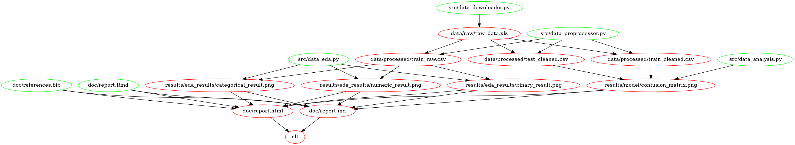

# Credibility Classification of Credit Card Clients

#### Contributors

- Chester Wang
- HanChen Wang
- Qurat-ul-Ain Azim
- Renee Kwon

A data analysis project titled 'Credibility Classification of Credit Card Clients' for DSCI 522 (Data Science workflows); a course in the Master of Data Science program at the University of British Columbia. The report of the analysis can be found [here](https://github.com/UBC-MDS/Credit_Card_Default_Prediction_Group13/blob/main/doc/report.md).

## About
In the field of risk management, one of the most common problems is default prediction. This allows companies to predict the credibility of each person, analyze the risk level and optimize decisions for better business economics. In this project, the main question we are asking is:

**Given a credit card holder's basic personal information (gender, education, age, history of past payment etc.), will the person default on next month's payment?**

Specifically, a credit default is defined as the behaviour when someone who borrowed the money stops making the required payments. In the dataset 1 indicates that the person has committed a credit default (fails to pay) while 0 indicates the person is paying the debt as required. 

## Research Question
Through this project, we aim to answer the question: Which attributes are most important when we use machine learning models to predict the default? Specifically we would like to know if the `weight` of attributes would change when we employ different models. Answering this question is, from our perspective, of great importance because it allows to understand what attributes relate to credibility the most. We would also aim to a comparative study of the mainstream machine learning classification models to be able to identify how the best performing model assigns weights to the various model features.

## Data Summary
We use a dataset hosted by the UCI machine learning repository (1). Originally it is collected by researchers from Chung Hua University and Tamkang University (2). As the probability of default cannot be actually acquired, the targets are obtained through estimation as stated by the authors of this dataset. The dataset consists of 30000 instances, with each consists of 23 attributes and a target. The raw dataset is about 5.5 MB large, and we split it into the training set (80%) and testing set (20%) for further use. The data attributes range from client's gender, age, education, previous payment history, credit amount etc.

## Data Analysis
Our preliminary EDA looked for missing values and for unclean data. We then studied and ploted the distributions of all the meaningful features. We also performed correlation analysis to examine if any feature had strong correlations with the target. You can read more about EDA in our final report [here](https://github.com/UBC-MDS/Credit_Card_Default_Prediction_Group13/blob/main/doc/report.md).

We then proceeded to build several machine learning models:
- Support Vector Machine
- Logistic Regression
- Decision Tree
- Ensemble Methods (e.g. Random Forest)
- KNN (both unweighted and weighted)

We scored their performance based on the f1 score, since we are interested in reducing both the false positives and false negatives. After empirical analysis, we choose the Logistic Regression Classifier model for our final analysis because it outperforms the rest of other models and its features are easily interpretable. 

## Dependencies

Our project is dependent on Python 3 with the following packages:
- altair==4.2.0
- vl-convert-python==0.5.0
- docopt=0.6.2
- numpy=1.23.3
- ipykernel
- scikit-learn==1.1.2
- pandas=1.4.4
- requests>=2.24.0
- scikit-learn=1.1.2
- scipy=1.9.2
- ipython>=7.15
- altair_saver
- selenium<4.3.0
- matplotlib>=3.5.3
- pandas-profiling
- pandoc
- joblib==1.1.0
- psutil>=5.7.2
- openpyxl>=3.0.0
- xlrd>=2.0.1
- xlwt>=1.3.0
And R, specifically we use RStudio of version:
- RStudio 2022.07.1+554 

The complete list of packages used can be found in the [environment file](https://github.com/UBC-MDS/Credit_Card_Default_Prediction_Group13/blob/main/environment.yaml).

For easy installation of the environment, please follow the steps below to:

Create an conda environment
```
conda env create --file environment.yaml
```

Activate the conda environment 
```
conda activate credit_default_env
```

Deactivate the conda environment 
```
conda deactivate
```

## Usage

To reproduce our analysis, you can choose to use Docker, run the Makefile commands, or run individual scripts sequentially in your command line/terminal tool at the root of this project directory. 

### 1. Cloning this repository (Required)

Clone this Github repo:
```
git clone https://github.com/UBC-MDS/Credit_Card_Default_Prediction_Group13.git
```

### 2. Using Docker
Please install Docker on your local machine. After installation, you can run the following command in the command line/terminal tool at the root of this project directory. *Estimated completion time: 30 minutes (MAC M2 8GB memory).* 
On Windows:
```
docker run --rm --platform linux/amd64 -v /$(pwd):/home/Credit_Card_Default_Prediction_Group13 chesteraigo/mds_522_credit_card_group_13:latest make -C '/home/Credit_Card_Default_Prediction_Group13' all
```

or Mac:
```
docker run --rm --platform linux/amd64-v "$PWD:/home/Credit_Card_Default_Prediction_Group13" chesteraigo/mds_522_credit_card_group_13:latest make -C '/home/Credit_Card_Default_Prediction_Group13' all
```

To clean up the repo, run the following command in the command line/terminal tool at the root of this project directory.
On Windows:

```
docker run --rm --platform linux/amd64 -v /$(pwd):/home/Credit_Card_Default_Prediction_Group13 chesteraigo/mds_522_credit_card_group_13:latest make -C '/home/Credit_Card_Default_Prediction_Group13' clean
```

On Mac:

```
docker run --rm --platform linux/amd64 -v "$PWD:/home/Credit_Card_Default_Prediction_Group13" chesteraigo/mds_522_credit_card_group_13:latest make -C '/home/Credit_Card_Default_Prediction_Group13' clean
```

Note: For non-M1 users, please remove the flag --platform linux/amd64.


### 3. With Makefile

You can reproduce the results in this GitHub repository by cloning and installing all necessary [dependencies](https://github.com/UBC-MDS/Credit_Card_Default_Prediction_Group13#dependencies). 

Then, you can run the command below using terminal in the root directory of this project to automatically run the full analysis and generate the final report. *Estimated completion time: 30 minutes (MAC M2 8GB memory).* 

```
make all 
```

To delete all intermediate and result files, run the following command using terminal in the root directory of this project:

```
make clean
```

##### Makefile Dependency Diagram

 

### 4. Run individual scripts sequentially

You can reproduce the results in this GitHub repository by cloning and installing all necessary [dependencies](https://github.com/UBC-MDS/Credit_Card_Default_Prediction_Group13#dependencies).

For reproducing the results in step-by-step manner, run the scripts below using terminal in a sequential manner in the root directory of this project:

```
python src/data_downloader.py --url=https://archive.ics.uci.edu/ml/machine-learning-databases/00350/default%20of%20credit%20card%20clients.xls --path=data/raw/
```

Some preprocessing, data cleaning and splitting can be performed via the following command:

```
python src/data_preprocessor.py --input=data/raw/raw_data.xls --output=data/processed/
```

The EDA can be performed as:

```
python src/data_eda.py --traindata=data/processed/train_raw.csv --output=results/eda_results/
```

And finally, the model building, model scoring, and predictive analysis can be done by running the following code in the terminal. *Estimated completion time: 30 minutes (MAC M2 8GB memory).*

```
python src/data_analysis.py --traindata=data/processed/train_cleaned.csv --testdata=data/processed/test_cleaned.csv --output=results/model/
```

To render the final report:

```
Rscript -e "rmarkdown::render('doc/report.Rmd')"
```

## Report

A report summarizing the results of our study can be found [here](https://github.com/UBC-MDS/Credit_Card_Default_Prediction_Group13/blob/main/doc/report.md).


## License
We use MIT license for this project.


## References

1. The original data set is located [here.](https://archive.ics.uci.edu/ml/datasets/default+of+credit+card+clients)
2. Yeh, I. C., & Lien, C. H. (2009). The comparisons of data mining techniques for the predictive accuracy of probability of default of credit card clients. Expert Systems with Applications, 36(2), 2473-2480.

