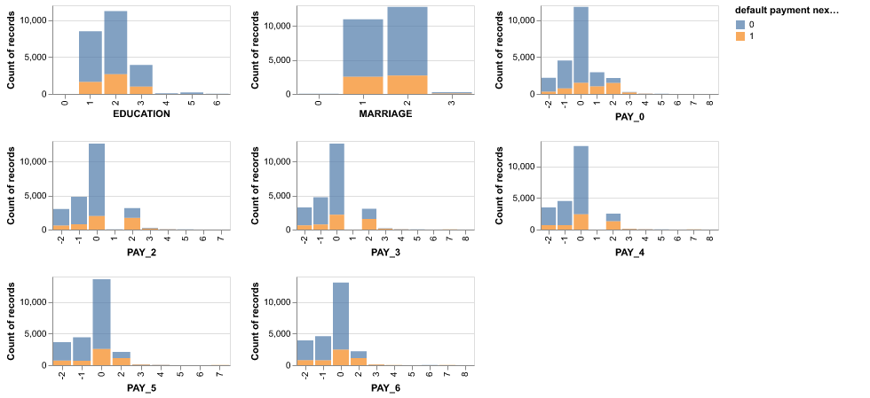
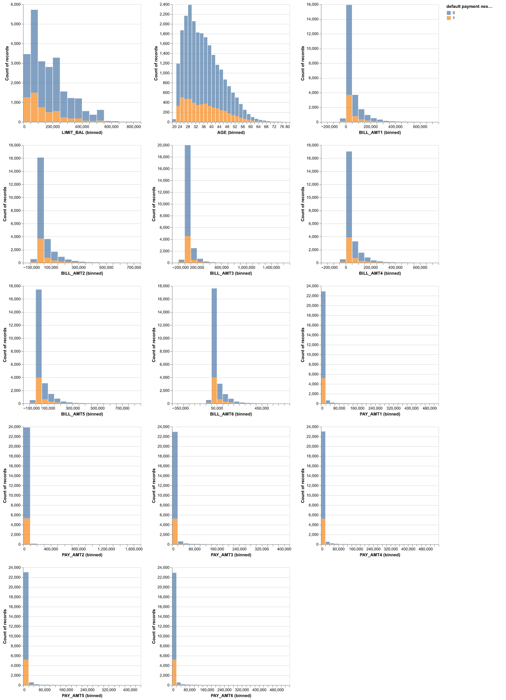

```{r setup, include=FALSE}
knitr::opts_chunk$set(echo = FALSE)
library(tidyverse)
library(knitr)
library(kableExtra)
```

```{r load model results}
model_score <- read.csv("../results/model/model_score.csv")
```

## Summary

In the field of risk management, one of the most common problems is default prediction.
This allows companies to predict the credibility of each person, analyze the risk level and optimize decisions for better business economics.
In this project, we aim to learn and predict a credit card holder's credibility based on his/her basic personal information (gender, education, age, history of past payment etc. ).

Our final classifier using the Logistic Regression model did not perform as well as we hoped on our unseen test data, with a final f1 score of `r round(as.numeric(model_score[10,2]), 2)`.
Of the `r sum(as.numeric(model_score[6:9,2]))` clients in our test data, our model correctly predicted the default status of `r sum(as.numeric(model_score[6,2]), as.numeric(model_score[9,2]))` clients correctly.
There were `r sum(as.numeric(model_score[7,2]), as.numeric(model_score[8,2]))` incorrect predictions, either a client will default on their payment when they have not or a client will not default when they have.
Incorrect predictions of either type can be costly for financial institutions and thus we will continue to study our data and improve our model before it is put into production.

## Introduction

Through this project, we aim to answer the predictive question:

***Given a credit card holder\'s basic personal information (gender, education, age, history of past payment etc.), will the person default on next month\'s payment?***

A credit default is defined as the behavior when someone who borrowed the money stops making the required payments.
In the data set, the target class 1 indicates that the person has committed a credit default (fails to pay) while 0 indicates the person is paying the debt as required.
Our evaluation is of great importance because it helps to understand which sets of attributes relate to credibility.
We would also aim to perform a comparative study of the mainstream machine learning classification models to be able to identify the best performing model in predicting credit default.

## Methods

### Dataset

We use a dataset hosted by the UCI machine learning repository (@Dua:2019).
Originally it is collected by researchers from Chung Hua University and Tamkang University (@YEH20092473, @uci_ml_data_set).
As the probability of default cannot be actually acquired, the targets are obtained through estimation as stated by the authors of this dataset.
The dataset consists of `r sum(as.integer(model_score[1:2,2]), as.integer(model_score[6:9,2]))` instances, where each observation consists of 23 attributes and a target.
The raw dataset is about 5.5 MB large, and we split it into the training set (80%) and testing set (20%) for further use.
The data attributes range from client's gender, age, education, previous payment history, credit amount etc.
You can access this data set by clicking [here](https://archive.ics.uci.edu/ml/datasets/default+of+credit+card+clients).

#### Feature Descriptions

##### Categorical Features

`Education` : 1 = graduate school; 2 = university; 3 = high school; 4 = other

`Marital status` : 1 = married; 2 = single; 3 = others

`PAY_X` , the history of monthly payment tracked from April to September, 2005 :

PAY_0 = repayment status in September, 2005;\
PAY_2 = repayment status in August, 2005;\
PAY_3 = repayment status in July, 2005;\
PAY_4 = repayment status in June, 2005;\
PAY_5 = the repayment status in May, 2005;\
PAY_6 = the repayment status in April, 2005

Scale for `PAY_X` :

-2 for no payment required;\
-1 = pay duly;\
1 = payment delay for one month;\
2 = payment delay for two months;\
... 9 = payment delay for nine months and above

##### Binary Features

`Sex` : 1 = male; 2 = female

##### Numeric features

`LIMIT_BAL` : the amount of given credit (in New Taiwan dollar), includes both the individual consumer credit and his/her family (supplementary) credit.

`Age` : the age of the individual (years).

`BILL_AMTX` : the amount of bill statement (NT dollar).\

BILL_AMT1 = amount of bill statement in September, 2005;\
BILL_AMT2 = amount of bill statement in August, 2005;\
BILL_AMT3 = amount of bill statement in July, 2005;\
BILL_AMT4 = amount of bill statement in June, 2005;\
BILL_AMT5 = amount of bill statement in May, 2005;\
BILL_AMT6 = amount of bill statement in April, 2005\

`PAY_AMTX` : Amount of previous payment (NT dollar)

PAY_AMT1 = amount paid in September, 2005;\
PAY_AMT2 = amount paid in August, 2005;\
PAY_AMT2 = amount paid in July, 2005;\
PAY_AMT2 = amount paid in June, 2005;\
PAY_AMT2 = amount paid in May, 2005;\
PAY_AMT2 = amount paid in April, 2005 

[Link to Source Data](https://archive.ics.uci.edu/ml/datasets/default+of+credit+card+clients).

## Analysis

### EDA

Our data has been split into training and testing splits, with 80% of the data (`r sum(as.integer(model_score[1:2,2]))`) in the training set and 20% (`r sum(as.integer(model_score[6:9,2]))`) in the test data.

There are no missing values in any rows or columns.

Upon our first look at the data, we found some features containing ambiguous categories, such as unlabeled feature categories.
We cleaned up the data to keep categories that were more meaningful.

After data cleaning, we identified 24 meaningful features, with one binary feature, eight categorical features, and fourteen numerical features.
Our target is `default_payment_next_month` that has two classes: class 0 representing the client paying their bill in the next month and class 1 representing a client choosing to default on their bill next month.

There is a class imbalance in our data, with `r round(as.numeric(model_score[1,2]) / sum(as.numeric(model_score[1:2,2])), 3) * 100`% of examples as target class 0 and `r round(as.numeric(model_score[2,2]) / sum(as.numeric(model_score[1:2,2])), 3) * 100`% as target class 1.

We have categorical features such as marriage, education, and monthly payment history.
Below is the distribution of our target class according to the various categories.
From these visualizations, we can see that the proportion of default (class 1) is similar in most categories, except in the all PAY features, high proportion of default occurred in labels 2 or above (meaning the person missed at least two months of payment at the time of data collection).

```{r out.width="95%", fig.align='center', fig.cap="**Figure 1.** Distribution of Categorical Features"}

```

There is one binary feature in our data set: sex of the client.
There is a higher number of female clients who have chosen to default on their payment.

```{r out.width="75%", fig.align='center', fig.cap="**Figure 2.** Distribution of Binary Feature"}
knitr::include_graphics("../results/eda_results/binary_result.png")
```

Numeric features include bill amounts, payment amounts, and age of the client.
From the visualizations, we get an idea that the default is not dependent on the months.
However, we will verify this using our prediction model.
We also see that there is a slight increase in the default ratio in the middle to late age group of clients.

```{r out.width="95%", fig.align='center', fig.cap="**Figure 3.** Distribution of Numeric Feature"}

```

Below is the correlation matrix for all of our features.
We see a positive correlation between the history of missing payment (all PAY categorical features) and defaulting, and a negative correlation between the credit limit offered to the client and defaulting.
Furthermore, we see negative correlations between past payment amount (PAY_AMT features) and defaulting.
These correlations somewhat make sense.

```{r fig.align='center'}
read.csv("../results/eda_results/corr.csv") %>%
  mutate_if(is.numeric, round, 2) %>%
  kable(caption = "Table 1. Correlation Matrix of all features") %>%
  kable_styling(full_width = F, font_size = 10) %>%
  kable_classic_2(full_width = F) %>%
  scroll_box(width = "100%", height = "200px")
```

## Predictive Model

We are interested in finding clients who are likely to default on their next payment.
We identified that we need to reduce both false positive (misidentifying a client will default) and false negatives (misidentifying a client will not default) in our prediction as these are important for client loyalty and for the bank to not lose money.

Therefore, we chose to evaluate our model using the f1 score as our metric.
The f1 score is calculated by:

$$\text{f1 score} = \frac{2\times precision \times recall}{precision + recall}$$

The following models were included in initial model screening with default hyperparameters:

-   Decision Tree Classifier
-   K Neighbours Classifier
-   RBF SVM
-   Logistic Regression Model
-   Ridge Classifier Model
-   Random Forest Classifier

The cross-validation scores are shown below:

```{r fig.align='center'}
header <- scan("../results/model/model_selection.csv", nlines = 1, what = character(), sep = ",", quiet = TRUE)
feat_table = read.csv("../results/model/model_selection.csv", skip=2, header=FALSE) %>%
  mutate_if(is.numeric, round, 2)
names(feat_table) <- header

kable(feat_table, caption = "Table 2. Cross-Validation Scores during Initial Model Screening") %>%
  kable_classic_2(full_width = F) 

```

The mean cross-validation score is the highest for the Random Forest Classifier but it is over-fit with train accuracy of 1.00.
The SVM RBF and KNN models are analogy-based methods that don't support our evaluation of the feature importance.
Ridge and Decision Tree Classifier are both good models but we chose **Logistic Regression Classifier** in the end as it can easily export feature importance and have a decent f1 score compared to the other models.

We continued performed hyperparameter optimization for the Logistic Regression model to find our optimal hyperparamaters:

`C` value as `r round(as.numeric(model_score[3,2]), 3)` and `class_weight` as `r model_score[4,2]`.

Using our model with these optimized hyperparameters, the mean f1 score in cross-validation was `r round(as.numeric(model_score[5,2]), 2)`.

## Results

We used our optimized Logistic Regression model to predict the test data of `r sum(as.integer(model_score[6:9,2]))` clients.
The f1 score on the test data was `r round(as.numeric(model_score[10,2]), 2)`, which is comparable to the f1 score of the cross-validation data.

We continued to export the regression coefficients for our features:

```{r fig.align='center'}
feat_table = read.csv("../results/model/feature_coefficient.csv") %>%
  select(c(Feature,Coefficient)) %>%
  mutate_if(is.numeric, round, 3)

kable(feat_table, caption = "Table 3. Feature Coefficients") %>%
  kable_classic_2(full_width = F) 
```

Our most positive coefficient was `PAY_0`: the default history of the client.
This is expected because the longer a client has delayed their payments as of September 2005, when the data was collected, the more likely they are to default.

`BILL_AMT3` and `BILL_AMT2` also have positive coefficients.
The higher the statement amount in the previous months (July and August), the more likely the client will default.

The most negative coefficient was `BILL_AMT1` which is expected as the higher the amount due in the September statement, the higher the likely a client will default that same month.

Also, `PAY_AMT1` and `PAY_AMT2` have negative coefficient in our model.
This also makes sense as higher payments in recent months (August and September) will result in less likelihood of a client defaulting.

When evaluating with the default status of the test data, our model made `r sum(as.numeric(model_score[6,2]), as.numeric(model_score[9,2]))` correct predictions for our clients, out of `r sum(as.integer(model_score[6:9,2]))` (`r round((sum(as.numeric(model_score[6,2]), as.numeric(model_score[9,2]))) / (sum(as.numeric(model_score[6:9,2]))), 3) * 100`%).

```{r out.width="50%", fig.align='center', fig.cap="**Figure 4.** Confusion Matrix"}
knitr::include_graphics("../results/model/confusion_matrix.png")
```

We falsely predicted `r model_score[8,2]` clients would not default and make their payment when in fact, they would not (false negative).
These false predictions would be costly for the institution in terms of opportunity cost as they could be charging a higher interest rate on these clients.

On the other hand, we made `r model_score[7,2]` false predictions on clients and predicted they would default, when they will not (false positive).
This is costly because a false labeling and a possible unjustified interest rate increase can lead to client dissatisfaction.

Our model did not perform as well as we hoped with an f1 test score of `r round(as.numeric(model_score[10,2]), 2)`.
The data contained a lot of noise, missing labels, and potentially non-linear relations that our model was not able to fit well.
Further improvements are needed before this model can be put into production.

## Further Improvements

Several things could be done to further improve this model.
First of all, further optimization through feature engineering and feature selection may be beneficial.
We may be able to get rid of some features that are noisy and have low correlation to our target value.
As well, as mentioned earlier, there were features that contained ambiguous categories and our model is not capturing the data that was sorted into "other" categories.

Proper data labelling needs to be done to account for this ambiguous data.
If possible, we can consult the company that made the data collection for the missing labels.
Lastly, more useful features would improve this model, such as income, size of the household, and amount of debt.
With more relevant features for our model to fit to, the data and our prediction accuracy will improve.

## References

This report was constructed using Rmarkdown [@Rrmarkdown], ReadR[@readr], Knitr [@knitr], kableExtra [@kableextra], and tidyverse [@tidy] in R [@R] and the following python [@python] packages: pandas[@pandas], numpy[@numpy], scikit-learn[@scikit-learn], altair[@altair], matplotlib [@matplotlib], and uci_ml_data_set [@uci_ml_data_set].
