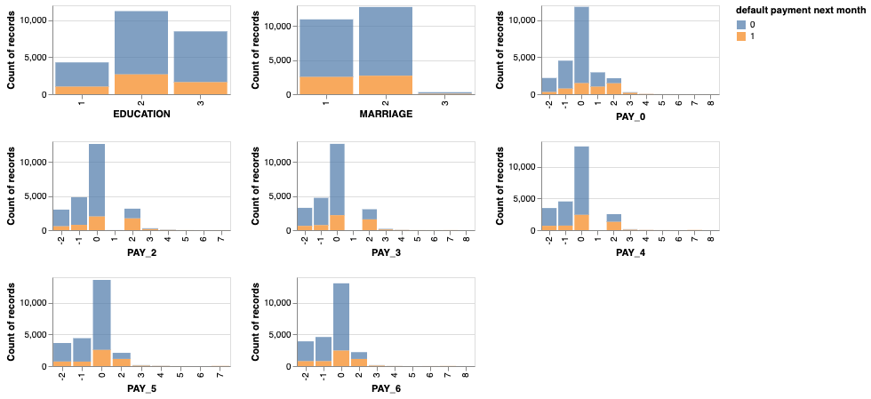
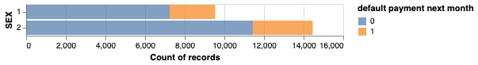
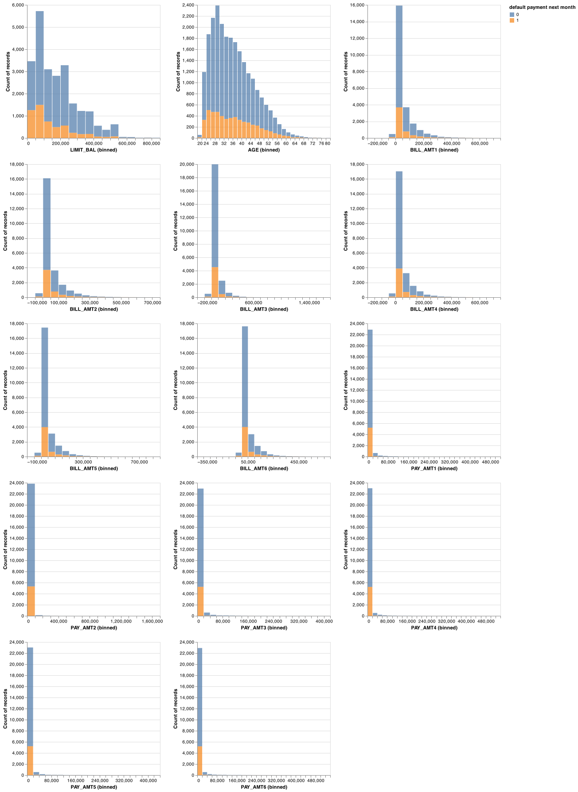
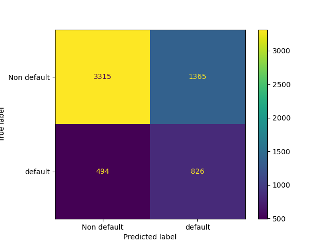

```{r setup, include=FALSE}
knitr::opts_chunk$set(echo = FALSE)
library(tidyverse)
library(knitr)
library(kableExtra)
```

# Summary

In the field of risk management, one of the most common problems is default prediction.
This allows companies to predict the credibility of each person, analyze the risk level and optimize decisions for better business economics.
In this project, we aim to learn and predict a credit card holder's credibility based on his/her basic personal information (gender, education, age, history of past payment etc. ).

Our final classifier using the Logistic Regression model did not perform as well as we hoped on our unseen test data, with a final f1 score of 0.471.
Of the 6,000 clients in our test data, our model correctly predicted the default status of 4,141 clients correctly.
There were 1,129 incorrect predictions, either predicting a customer will default on their payment when they have not or a customer will not default when they have.
Incorrect predictions of either type can be costly for financial institutions and thus we will continue to study our data and improve our model before it is put into production.

# Introduction

Through this project, we aim to answer the question: Which attributes are most important when we use machine learning models to predict the default?
Specifically we would like to know if the weight of attributes would change when we employ different models.
Answering this question is, from our perspective, of great importance because it allows to understand what attributes relate to credibility the most.
We would also aim to perform a comparative study of the mainstream machine learning classification models to be able to identify how the best performing model assigns weights to the various model features.

# Methods

## Dataset

We use a dataset hosted by the UCI machine learning repository.
Originally it is collected by researchers from Chung Hua University and Tamkang University.
As the probability of default cannot be actually acquired, the targets are obtained through estimation as stated by the authors of this dataset.
The dataset consists of 30000 instances, where each observation consists of 23 attributes and a target.
The raw dataset is about 5.5 MB large, and we split it into the training set (80%) and testing set (20%) for further use.
The data attributes range from client's gender, age, education, previous payment history, credit amount etc.

## Feature Descriptions

#### Categorical Features

`Education`: Ordinal feature.
1 = graduate school; 2 = university; 3 = high school; 4 = others.\

`Marital status`: 1 = married; 2 = single; 3 = others.\

`PAY_X`: Ordinal feature.
The history of monthly payment tracked from April to September, 2005, as follows: PAY_1 = the repayment status in September, 2005; PAY_2 = the repayment status in August, 2005; .
. .;PAY_6 = the repayment status in April, 2005.
The measurement scale for the repayment status is: -2 = no payment required; -1 = pay duly; 1 = payment delay for one month; 2 = payment delay for two months; .
. .; 8 = payment delay for eight months; 9 = payment delay for nine months and above.

#### Binary Features

`Sex` is reported as a binary feature (1 = male; 2 = female).

#### Numeric features

`LIMIT_BAL`: The amount of the given credit (NT dollar): it includes both the individual consumer credit and his/her family (supplementary) credit.\

`Age`: The age of the individual (years).\

`BILL_AMTX`: Amount of bill statement (NT dollar).
BILL_AMT1 = amount of bill statement in September, 2005; BILL_AMT2 = amount of bill statement in August, 2005; .
. .; BILL_AMT6 = amount of bill statement in April, 2005.\

`PAY_AMTX`: Amount of previous payment (NT dollar).
PAY_AMT1 = amount paid in September, 2005; PAY_AMT2 = amount paid in August, 2005; .
. .;PAY_AMT6 = amount paid in April, 2005.

[Link to Source Data](https://archive.ics.uci.edu/ml/datasets/default+of+credit+card+clients).

# Analysis

#### EDA

There are 30,000 observations of credit card clients in our dataset with no missing values in any rows or columns.

Upon our first look at the data, we found some features containing ambiguous categories.
We cleaned up the data so the categories were more meaningful.

We have 24 usable features in total, with one binary feature, eight categorical features, and 14 numerical features.
Our target column is `default_payment_next_month` that has two classes: class 0 representing the client paying their bill in the next month and class 1 representing a client choosing to default on their bill in the next month.

There is class imbalance in our data, with 77.9% of examples as class 1 and 22.1% as class 0.

We have categorical features such as marriage, education, and monthly payment history.
Below is the distribution of our target class according to the various categories.

```{r out.width="95%", fig.align='center', fig.cap="**Figure 1.** Distribution of Categorical Features"}

```

There is one binary feature in our data set: sex of the client.
There is a higher proportion of female clients who have defaulted in our dataset.

```{r out.width="75%", fig.align='center', fig.cap="**Figure 2.** Distribution of Binary Feature"}

```

Numeric features include bill amounts, payment amounts, and age of the client.
We get an idea that the default ratio is not dependent on the months, however, we will verify this using our prediction model.
We also see that there is a slight increase in the default ratio in the middle to late age range of our clients.

```{r out.width="95%", fig.align='center', fig.cap="**Figure 3.** Distribution of Numeric Feature"}

```

Below is the correlation matrix for all of our features.
We see a strong correlation between our target and payment history as well as the credit limit offered to the client.

```{r fig.align='center'}
kable(round(cor(read.csv("../data/eda_results/corr.csv")), 2),
      caption = "**Table 1.** Correlation Matrix") %>%
  kable_styling(full_width = F, font_size = 10) %>%
  kable_classic_2(full_width = F) %>%
  scroll_box(width = "100%", height = "200px")
```

# Predictive Model

We are interested in finding clients who are likely to default on their next payment but falsely predicting a client will default can be costly in terms of customer loyalty.
Therefore, we chose to build our model using the f1 score as our metric.

The following models were tested and compared:

-   Decision Tree Classifier
-   K Neighbours Classifier
-   RBF SVM
-   Logistic Regression Model
-   Ridge Classifier Model
-   Random Forest Classifier

From the cross validation scores for each of these models, the mean validation score returned highest for the Random Forest Classifier as 0.47.
However, we chose to use the Logistic Regression Classifier so that we are able to get a sense of whether a feature has a positive or negative impact on our prediction.

We then performed hyperparameter optimization for the Logistic Regression model to find our optimum hyperparamater `C` value as `0.438` and `class_weight = balanced`.
Using our model with optimized hyperparameters, the f1 validation score returned was 0.479.

# Results

We used our optimized Logistic Regression model on the test data of 6,000 clients.
The f1 score on the test data was 0.467.

From the coefficient table below, we see the most important positively associated features is `PAY_0`: the default history of the client.
This is expected because the longer a client has delayed their payments, the more likely they are to default in that month.
`BILL_AMT3` was the second strongest positively associated feature returned from our model - which corresponds to the bill amount due in the month of July.
This is also comparable to the bill amounts of the neighbouring months.

The strongest negative coefficient was `BILL_AMT1` which is expected as the lower the amount due in the previous month, the higher the likely a client will default.
Also, `PAY_AMT2` was a strong predicting variable for the default classification.
This also makes sense as higher payments in recent month will result in less likelihood of a client defaulting.

Below is the table of the coefficients of all the features.

```{r}
feat_table = read.csv("../data/results/feature_coefficient.csv") %>%
  select(c(Feature,Coefficient))

kable(feat_table) %>%
  kable_classic_2(full_width = F)
```

Our model made 4,141 correct predictions for our clients, out of 6,000 (69%).


```{r out.width="50%", fig.align='center', fig.cap="**Figure 4.** Confusion Matrix"}

```

We predicted 494 clients would not default and make their payment when in fact, they would not.
These false predictions would be costly for the institution in terms of opportunity cost as they could be charging a higher interest rate on these clients.
On the other hand, we made 1365 false predictions on clients and predicted they would default, when they will not.
This is costly because a false labeling and a possible unjustified interest rate increase can lead to client dissatisfaction.

Our model did not perform as well as we hoped with an f1 test score of 0.471.
The data we started with contained a lot of noise and non-linear relations that our model was not able to fit well to and further improvements will need to be made before it is put into production.

# Further Improvements

Several things could be done to further improve this model.
First of all, further optimization through feature engineering and feature selection may be beneficial.
We may be able to get rid of some features that are noisy and have low correlation to our target value.
As well, as mentioned earlier, there were features that contained ambiguous categories and our model is not capturing the data that was sorted into "other" categories.
Proper data labelling needs to be done to account for this ambiguous data.
Lastly, more useful features would improve this model, such as income, size of the household, and amount of debt.
With more relevant features for our model to fit to, the data and our prediction accuracy will improve.

This report was constructed using Rmarkdown [@Rrmarkdown], ReadR[@readr], Knitr [@knitr], kableExtra [@kableextra], and tidyverse [@tidy] in R [@R] and the following python [@python] packages: pandas[@pandas], numpy[@numpy], scikit-learn[@scikit-learn], altair[@altair], matplotlib [@matplotlib], and uci_ml_data_set [@uci_ml_data_set].

# References
