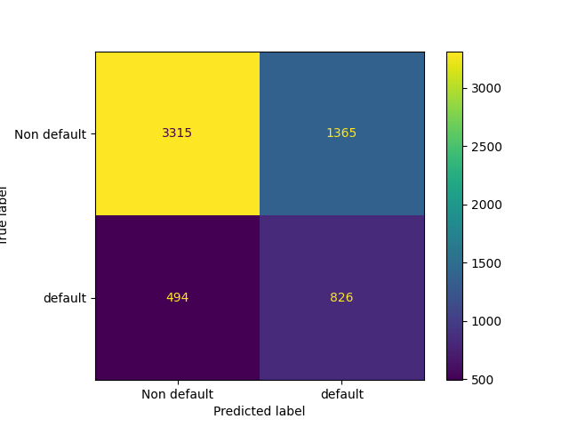

Credibility Classification of Credit Card Clients
================
Team 13 - Chester Wang, HanChen Wang, Qurat-ul-Ain Azim, Renee Kwon
11/26/2022 (updated: 2022-12-04)

- <a href="#summary" id="toc-summary">Summary</a>
- <a href="#introduction" id="toc-introduction">Introduction</a>
- <a href="#methods" id="toc-methods">Methods</a>
  - <a href="#dataset" id="toc-dataset">Dataset</a>
- <a href="#analysis" id="toc-analysis">Analysis</a>
  - <a href="#eda" id="toc-eda">EDA</a>
- <a href="#predictive-model" id="toc-predictive-model">Predictive
  Model</a>
- <a href="#results" id="toc-results">Results</a>
- <a href="#further-improvements" id="toc-further-improvements">Further
  Improvements</a>
- <a href="#references" id="toc-references">References</a>

## Summary

In the field of risk management, one of the most common problems is
default prediction. This allows companies to predict the credibility of
each person, analyze the risk level and optimize decisions for better
business economics. In this project, we aim to learn and predict a
credit card holder’s credibility based on his/her basic personal
information (gender, education, age, history of past payment etc. ).

Our final classifier using the Logistic Regression model did not perform
as well as we hoped on our unseen test data, with a final f1 score of
0.47. Of the 6000 clients in our test data, our model correctly
predicted the default status of 4141 clients correctly. There were 1859
incorrect predictions, either a client will default on their payment
when they have not or a client will not default when they have.
Incorrect predictions of either type can be costly for financial
institutions and thus we will continue to study our data and improve our
model before it is put into production.

## Introduction

Through this project, we aim to answer the predictive question:

***Given a credit card holder's basic personal information (gender,
education, age, history of past payment etc.), will the person default
on next month's payment?***

A credit default is defined as the behavior when someone who borrowed
the money stops making the required payments. In the data set, the
target class 1 indicates that the person has committed a credit default
(fails to pay) while 0 indicates the person is paying the debt as
required. Our evaluation is of great importance because it helps to
understand which sets of attributes relate to credibility. We would also
aim to perform a comparative study of the mainstream machine learning
classification models to be able to identify the best performing model
in predicting credit default.

## Methods

### Dataset

We use a dataset hosted by the UCI machine learning repository (Dua and
Graff (2017)). Originally it is collected by researchers from Chung Hua
University and Tamkang University (Yeh and Lien (2009), (n.d.)). As the
probability of default cannot be actually acquired, the targets are
obtained through estimation as stated by the authors of this dataset.
The dataset consists of 30000 instances, where each observation consists
of 23 attributes and a target. The raw dataset is about 5.5 MB large,
and we split it into the training set (80%) and testing set (20%) for
further use. The data attributes range from client’s gender, age,
education, previous payment history, credit amount etc. You can access
this data set by clicking
[here](https://archive.ics.uci.edu/ml/datasets/default+of+credit+card+clients).

#### Feature Descriptions

##### Categorical Features

`Education` : 1 = graduate school; 2 = university; 3 = high school; 4 =
other

`Marital status` : 1 = married; 2 = single; 3 = others

`PAY_X` , the history of monthly payment tracked from April to
September, 2005 :

PAY_0 = repayment status in September, 2005;  
PAY_2 = repayment status in August, 2005;  
PAY_3 = repayment status in July, 2005;  
PAY_4 = repayment status in June, 2005;  
PAY_5 = the repayment status in May, 2005;  
PAY_6 = the repayment status in April, 2005

Scale for `PAY_X` :

-2 for no payment required;  
-1 = pay duly;  
1 = payment delay for one month;  
2 = payment delay for two months;  
… 9 = payment delay for nine months and above

##### Binary Features

`Sex` : 1 = male; 2 = female

##### Numeric features

`LIMIT_BAL` : the amount of given credit (in New Taiwan dollar),
includes both the individual consumer credit and his/her family
(supplementary) credit.

`Age` : the age of the individual (years).

`BILL_AMTX` : the amount of bill statement (NT dollar).  

BILL_AMT1 = amount of bill statement in September, 2005;  
BILL_AMT2 = amount of bill statement in August, 2005;  
BILL_AMT3 = amount of bill statement in July, 2005;  
BILL_AMT4 = amount of bill statement in June, 2005;  
BILL_AMT5 = amount of bill statement in May, 2005;  
BILL_AMT6 = amount of bill statement in April, 2005  

`PAY_AMTX` : Amount of previous payment (NT dollar)

PAY_AMT1 = amount paid in September, 2005;  
PAY_AMT2 = amount paid in August, 2005;  
PAY_AMT2 = amount paid in July, 2005;  
PAY_AMT2 = amount paid in June, 2005;  
PAY_AMT2 = amount paid in May, 2005;  
PAY_AMT2 = amount paid in April, 2005 

[Link to Source
Data](https://archive.ics.uci.edu/ml/datasets/default+of+credit+card+clients).

## Analysis

### EDA

Our data has been split into training and testing splits, with 80% of
the data (24000) in the training set and 20% (6000) in the test data.

There are no missing values in any rows or columns.

Upon our first look at the data, we found some features containing
ambiguous categories, such as unlabeled feature categories. We cleaned
up the data to keep categories that were more meaningful.

After data cleaning, we identified 24 meaningful features, with one
binary feature, eight categorical features, and fourteen numerical
features. Our target is `default_payment_next_month` that has two
classes: class 0 representing the client paying their bill in the next
month and class 1 representing a client choosing to default on their
bill next month.

There is a class imbalance in our data, with 77.8% of examples as target
class 0 and 22.2% as target class 1.

We have categorical features such as marriage, education, and monthly
payment history. Below is the distribution of our target class according
to the various categories. From these visualizations, we can see that
the proportion of default (class 1) is similar in most categories,
except in the all PAY features, high proportion of default occurred in
labels 2 or above (meaning the person missed at least two months of
payment at the time of data collection).

There is one binary feature in our data set: sex of the client. There is
a higher number of female clients who have chosen to default on their
payment.

Numeric features include bill amounts, payment amounts, and age of the
client. From the visualizations, we get an idea that the default is not
dependent on the months. However, we will verify this using our
prediction model. We also see that there is a slight increase in the
default ratio in the middle to late age group of clients.

Below is the correlation matrix for all of our features. We see a
positive correlation between the history of missing payment (all PAY
categorical features) and defaulting, and a negative correlation between
the credit limit offered to the client and defaulting. Furthermore, we
see negative correlations between past payment amount (PAY_AMT features)
and defaulting. These correlations somewhat make sense.

<table class="table lightable-classic-2" style="font-size: 10px; width: auto !important; margin-left: auto; margin-right: auto; font-family: &quot;Arial Narrow&quot;, &quot;Source Sans Pro&quot;, sans-serif; width: auto !important; margin-left: auto; margin-right: auto;">
<caption style="font-size: initial !important;">
Table 1. Correlation Matrix of all features
</caption>
<thead>
<tr>
<th style="text-align:left;position: sticky; top:0; background-color: #FFFFFF;">
X
</th>
<th style="text-align:right;position: sticky; top:0; background-color: #FFFFFF;">
ID
</th>
<th style="text-align:right;position: sticky; top:0; background-color: #FFFFFF;">
LIMIT_BAL
</th>
<th style="text-align:right;position: sticky; top:0; background-color: #FFFFFF;">
SEX
</th>
<th style="text-align:right;position: sticky; top:0; background-color: #FFFFFF;">
EDUCATION
</th>
<th style="text-align:right;position: sticky; top:0; background-color: #FFFFFF;">
MARRIAGE
</th>
<th style="text-align:right;position: sticky; top:0; background-color: #FFFFFF;">
AGE
</th>
<th style="text-align:right;position: sticky; top:0; background-color: #FFFFFF;">
PAY_0
</th>
<th style="text-align:right;position: sticky; top:0; background-color: #FFFFFF;">
PAY_2
</th>
<th style="text-align:right;position: sticky; top:0; background-color: #FFFFFF;">
PAY_3
</th>
<th style="text-align:right;position: sticky; top:0; background-color: #FFFFFF;">
PAY_4
</th>
<th style="text-align:right;position: sticky; top:0; background-color: #FFFFFF;">
PAY_5
</th>
<th style="text-align:right;position: sticky; top:0; background-color: #FFFFFF;">
PAY_6
</th>
<th style="text-align:right;position: sticky; top:0; background-color: #FFFFFF;">
BILL_AMT1
</th>
<th style="text-align:right;position: sticky; top:0; background-color: #FFFFFF;">
BILL_AMT2
</th>
<th style="text-align:right;position: sticky; top:0; background-color: #FFFFFF;">
BILL_AMT3
</th>
<th style="text-align:right;position: sticky; top:0; background-color: #FFFFFF;">
BILL_AMT4
</th>
<th style="text-align:right;position: sticky; top:0; background-color: #FFFFFF;">
BILL_AMT5
</th>
<th style="text-align:right;position: sticky; top:0; background-color: #FFFFFF;">
BILL_AMT6
</th>
<th style="text-align:right;position: sticky; top:0; background-color: #FFFFFF;">
PAY_AMT1
</th>
<th style="text-align:right;position: sticky; top:0; background-color: #FFFFFF;">
PAY_AMT2
</th>
<th style="text-align:right;position: sticky; top:0; background-color: #FFFFFF;">
PAY_AMT3
</th>
<th style="text-align:right;position: sticky; top:0; background-color: #FFFFFF;">
PAY_AMT4
</th>
<th style="text-align:right;position: sticky; top:0; background-color: #FFFFFF;">
PAY_AMT5
</th>
<th style="text-align:right;position: sticky; top:0; background-color: #FFFFFF;">
PAY_AMT6
</th>
<th style="text-align:right;position: sticky; top:0; background-color: #FFFFFF;">
default.payment.next.month
</th>
</tr>
</thead>
<tbody>
<tr>
<td style="text-align:left;">
ID
</td>
<td style="text-align:right;">
1.00
</td>
<td style="text-align:right;">
0.03
</td>
<td style="text-align:right;">
0.02
</td>
<td style="text-align:right;">
0.03
</td>
<td style="text-align:right;">
-0.03
</td>
<td style="text-align:right;">
0.03
</td>
<td style="text-align:right;">
-0.02
</td>
<td style="text-align:right;">
0.00
</td>
<td style="text-align:right;">
-0.01
</td>
<td style="text-align:right;">
0.00
</td>
<td style="text-align:right;">
-0.01
</td>
<td style="text-align:right;">
0.00
</td>
<td style="text-align:right;">
0.02
</td>
<td style="text-align:right;">
0.01
</td>
<td style="text-align:right;">
0.02
</td>
<td style="text-align:right;">
0.04
</td>
<td style="text-align:right;">
0.02
</td>
<td style="text-align:right;">
0.02
</td>
<td style="text-align:right;">
0.02
</td>
<td style="text-align:right;">
0.06
</td>
<td style="text-align:right;">
0.09
</td>
<td style="text-align:right;">
0.02
</td>
<td style="text-align:right;">
0.01
</td>
<td style="text-align:right;">
0.04
</td>
<td style="text-align:right;">
-0.01
</td>
</tr>
<tr>
<td style="text-align:left;">
LIMIT_BAL
</td>
<td style="text-align:right;">
0.03
</td>
<td style="text-align:right;">
1.00
</td>
<td style="text-align:right;">
0.06
</td>
<td style="text-align:right;">
-0.27
</td>
<td style="text-align:right;">
-0.12
</td>
<td style="text-align:right;">
0.19
</td>
<td style="text-align:right;">
-0.30
</td>
<td style="text-align:right;">
-0.34
</td>
<td style="text-align:right;">
-0.33
</td>
<td style="text-align:right;">
-0.31
</td>
<td style="text-align:right;">
-0.28
</td>
<td style="text-align:right;">
-0.26
</td>
<td style="text-align:right;">
0.06
</td>
<td style="text-align:right;">
0.05
</td>
<td style="text-align:right;">
0.06
</td>
<td style="text-align:right;">
0.08
</td>
<td style="text-align:right;">
0.09
</td>
<td style="text-align:right;">
0.09
</td>
<td style="text-align:right;">
0.28
</td>
<td style="text-align:right;">
0.28
</td>
<td style="text-align:right;">
0.29
</td>
<td style="text-align:right;">
0.29
</td>
<td style="text-align:right;">
0.30
</td>
<td style="text-align:right;">
0.32
</td>
<td style="text-align:right;">
-0.17
</td>
</tr>
<tr>
<td style="text-align:left;">
SEX
</td>
<td style="text-align:right;">
0.02
</td>
<td style="text-align:right;">
0.06
</td>
<td style="text-align:right;">
1.00
</td>
<td style="text-align:right;">
0.02
</td>
<td style="text-align:right;">
-0.03
</td>
<td style="text-align:right;">
-0.09
</td>
<td style="text-align:right;">
-0.06
</td>
<td style="text-align:right;">
-0.08
</td>
<td style="text-align:right;">
-0.07
</td>
<td style="text-align:right;">
-0.07
</td>
<td style="text-align:right;">
-0.06
</td>
<td style="text-align:right;">
-0.05
</td>
<td style="text-align:right;">
-0.05
</td>
<td style="text-align:right;">
-0.05
</td>
<td style="text-align:right;">
-0.04
</td>
<td style="text-align:right;">
-0.03
</td>
<td style="text-align:right;">
-0.02
</td>
<td style="text-align:right;">
-0.01
</td>
<td style="text-align:right;">
-0.01
</td>
<td style="text-align:right;">
0.00
</td>
<td style="text-align:right;">
0.02
</td>
<td style="text-align:right;">
0.01
</td>
<td style="text-align:right;">
0.01
</td>
<td style="text-align:right;">
0.03
</td>
<td style="text-align:right;">
-0.04
</td>
</tr>
<tr>
<td style="text-align:left;">
EDUCATION
</td>
<td style="text-align:right;">
0.03
</td>
<td style="text-align:right;">
-0.27
</td>
<td style="text-align:right;">
0.02
</td>
<td style="text-align:right;">
1.00
</td>
<td style="text-align:right;">
-0.16
</td>
<td style="text-align:right;">
0.16
</td>
<td style="text-align:right;">
0.13
</td>
<td style="text-align:right;">
0.17
</td>
<td style="text-align:right;">
0.16
</td>
<td style="text-align:right;">
0.15
</td>
<td style="text-align:right;">
0.14
</td>
<td style="text-align:right;">
0.12
</td>
<td style="text-align:right;">
0.09
</td>
<td style="text-align:right;">
0.09
</td>
<td style="text-align:right;">
0.08
</td>
<td style="text-align:right;">
0.07
</td>
<td style="text-align:right;">
0.06
</td>
<td style="text-align:right;">
0.05
</td>
<td style="text-align:right;">
-0.05
</td>
<td style="text-align:right;">
-0.05
</td>
<td style="text-align:right;">
-0.05
</td>
<td style="text-align:right;">
-0.05
</td>
<td style="text-align:right;">
-0.05
</td>
<td style="text-align:right;">
-0.05
</td>
<td style="text-align:right;">
0.05
</td>
</tr>
<tr>
<td style="text-align:left;">
MARRIAGE
</td>
<td style="text-align:right;">
-0.03
</td>
<td style="text-align:right;">
-0.12
</td>
<td style="text-align:right;">
-0.03
</td>
<td style="text-align:right;">
-0.16
</td>
<td style="text-align:right;">
1.00
</td>
<td style="text-align:right;">
-0.47
</td>
<td style="text-align:right;">
0.02
</td>
<td style="text-align:right;">
0.04
</td>
<td style="text-align:right;">
0.05
</td>
<td style="text-align:right;">
0.05
</td>
<td style="text-align:right;">
0.05
</td>
<td style="text-align:right;">
0.05
</td>
<td style="text-align:right;">
0.01
</td>
<td style="text-align:right;">
0.01
</td>
<td style="text-align:right;">
0.00
</td>
<td style="text-align:right;">
0.01
</td>
<td style="text-align:right;">
0.01
</td>
<td style="text-align:right;">
0.01
</td>
<td style="text-align:right;">
0.00
</td>
<td style="text-align:right;">
-0.02
</td>
<td style="text-align:right;">
-0.01
</td>
<td style="text-align:right;">
-0.02
</td>
<td style="text-align:right;">
-0.01
</td>
<td style="text-align:right;">
-0.02
</td>
<td style="text-align:right;">
-0.02
</td>
</tr>
<tr>
<td style="text-align:left;">
AGE
</td>
<td style="text-align:right;">
0.03
</td>
<td style="text-align:right;">
0.19
</td>
<td style="text-align:right;">
-0.09
</td>
<td style="text-align:right;">
0.16
</td>
<td style="text-align:right;">
-0.47
</td>
<td style="text-align:right;">
1.00
</td>
<td style="text-align:right;">
-0.07
</td>
<td style="text-align:right;">
-0.09
</td>
<td style="text-align:right;">
-0.09
</td>
<td style="text-align:right;">
-0.08
</td>
<td style="text-align:right;">
-0.09
</td>
<td style="text-align:right;">
-0.08
</td>
<td style="text-align:right;">
0.00
</td>
<td style="text-align:right;">
0.00
</td>
<td style="text-align:right;">
0.00
</td>
<td style="text-align:right;">
0.00
</td>
<td style="text-align:right;">
0.00
</td>
<td style="text-align:right;">
0.00
</td>
<td style="text-align:right;">
0.04
</td>
<td style="text-align:right;">
0.05
</td>
<td style="text-align:right;">
0.03
</td>
<td style="text-align:right;">
0.04
</td>
<td style="text-align:right;">
0.04
</td>
<td style="text-align:right;">
0.04
</td>
<td style="text-align:right;">
0.00
</td>
</tr>
<tr>
<td style="text-align:left;">
PAY_0
</td>
<td style="text-align:right;">
-0.02
</td>
<td style="text-align:right;">
-0.30
</td>
<td style="text-align:right;">
-0.06
</td>
<td style="text-align:right;">
0.13
</td>
<td style="text-align:right;">
0.02
</td>
<td style="text-align:right;">
-0.07
</td>
<td style="text-align:right;">
1.00
</td>
<td style="text-align:right;">
0.63
</td>
<td style="text-align:right;">
0.55
</td>
<td style="text-align:right;">
0.52
</td>
<td style="text-align:right;">
0.48
</td>
<td style="text-align:right;">
0.46
</td>
<td style="text-align:right;">
0.31
</td>
<td style="text-align:right;">
0.33
</td>
<td style="text-align:right;">
0.31
</td>
<td style="text-align:right;">
0.30
</td>
<td style="text-align:right;">
0.30
</td>
<td style="text-align:right;">
0.29
</td>
<td style="text-align:right;">
-0.10
</td>
<td style="text-align:right;">
-0.07
</td>
<td style="text-align:right;">
-0.06
</td>
<td style="text-align:right;">
-0.04
</td>
<td style="text-align:right;">
-0.03
</td>
<td style="text-align:right;">
-0.05
</td>
<td style="text-align:right;">
0.29
</td>
</tr>
<tr>
<td style="text-align:left;">
PAY_2
</td>
<td style="text-align:right;">
0.00
</td>
<td style="text-align:right;">
-0.34
</td>
<td style="text-align:right;">
-0.08
</td>
<td style="text-align:right;">
0.17
</td>
<td style="text-align:right;">
0.04
</td>
<td style="text-align:right;">
-0.09
</td>
<td style="text-align:right;">
0.63
</td>
<td style="text-align:right;">
1.00
</td>
<td style="text-align:right;">
0.80
</td>
<td style="text-align:right;">
0.71
</td>
<td style="text-align:right;">
0.67
</td>
<td style="text-align:right;">
0.63
</td>
<td style="text-align:right;">
0.57
</td>
<td style="text-align:right;">
0.55
</td>
<td style="text-align:right;">
0.52
</td>
<td style="text-align:right;">
0.49
</td>
<td style="text-align:right;">
0.48
</td>
<td style="text-align:right;">
0.46
</td>
<td style="text-align:right;">
0.02
</td>
<td style="text-align:right;">
0.08
</td>
<td style="text-align:right;">
0.08
</td>
<td style="text-align:right;">
0.09
</td>
<td style="text-align:right;">
0.10
</td>
<td style="text-align:right;">
0.08
</td>
<td style="text-align:right;">
0.21
</td>
</tr>
<tr>
<td style="text-align:left;">
PAY_3
</td>
<td style="text-align:right;">
-0.01
</td>
<td style="text-align:right;">
-0.33
</td>
<td style="text-align:right;">
-0.07
</td>
<td style="text-align:right;">
0.16
</td>
<td style="text-align:right;">
0.05
</td>
<td style="text-align:right;">
-0.09
</td>
<td style="text-align:right;">
0.55
</td>
<td style="text-align:right;">
0.80
</td>
<td style="text-align:right;">
1.00
</td>
<td style="text-align:right;">
0.80
</td>
<td style="text-align:right;">
0.72
</td>
<td style="text-align:right;">
0.67
</td>
<td style="text-align:right;">
0.52
</td>
<td style="text-align:right;">
0.59
</td>
<td style="text-align:right;">
0.55
</td>
<td style="text-align:right;">
0.53
</td>
<td style="text-align:right;">
0.51
</td>
<td style="text-align:right;">
0.48
</td>
<td style="text-align:right;">
0.21
</td>
<td style="text-align:right;">
0.03
</td>
<td style="text-align:right;">
0.10
</td>
<td style="text-align:right;">
0.12
</td>
<td style="text-align:right;">
0.12
</td>
<td style="text-align:right;">
0.10
</td>
<td style="text-align:right;">
0.19
</td>
</tr>
<tr>
<td style="text-align:left;">
PAY_4
</td>
<td style="text-align:right;">
0.00
</td>
<td style="text-align:right;">
-0.31
</td>
<td style="text-align:right;">
-0.07
</td>
<td style="text-align:right;">
0.15
</td>
<td style="text-align:right;">
0.05
</td>
<td style="text-align:right;">
-0.08
</td>
<td style="text-align:right;">
0.52
</td>
<td style="text-align:right;">
0.71
</td>
<td style="text-align:right;">
0.80
</td>
<td style="text-align:right;">
1.00
</td>
<td style="text-align:right;">
0.82
</td>
<td style="text-align:right;">
0.73
</td>
<td style="text-align:right;">
0.51
</td>
<td style="text-align:right;">
0.56
</td>
<td style="text-align:right;">
0.62
</td>
<td style="text-align:right;">
0.59
</td>
<td style="text-align:right;">
0.56
</td>
<td style="text-align:right;">
0.53
</td>
<td style="text-align:right;">
0.18
</td>
<td style="text-align:right;">
0.24
</td>
<td style="text-align:right;">
0.07
</td>
<td style="text-align:right;">
0.14
</td>
<td style="text-align:right;">
0.16
</td>
<td style="text-align:right;">
0.14
</td>
<td style="text-align:right;">
0.17
</td>
</tr>
<tr>
<td style="text-align:left;">
PAY_5
</td>
<td style="text-align:right;">
-0.01
</td>
<td style="text-align:right;">
-0.28
</td>
<td style="text-align:right;">
-0.06
</td>
<td style="text-align:right;">
0.14
</td>
<td style="text-align:right;">
0.05
</td>
<td style="text-align:right;">
-0.09
</td>
<td style="text-align:right;">
0.48
</td>
<td style="text-align:right;">
0.67
</td>
<td style="text-align:right;">
0.72
</td>
<td style="text-align:right;">
0.82
</td>
<td style="text-align:right;">
1.00
</td>
<td style="text-align:right;">
0.82
</td>
<td style="text-align:right;">
0.50
</td>
<td style="text-align:right;">
0.53
</td>
<td style="text-align:right;">
0.58
</td>
<td style="text-align:right;">
0.65
</td>
<td style="text-align:right;">
0.62
</td>
<td style="text-align:right;">
0.58
</td>
<td style="text-align:right;">
0.17
</td>
<td style="text-align:right;">
0.22
</td>
<td style="text-align:right;">
0.26
</td>
<td style="text-align:right;">
0.11
</td>
<td style="text-align:right;">
0.19
</td>
<td style="text-align:right;">
0.17
</td>
<td style="text-align:right;">
0.16
</td>
</tr>
<tr>
<td style="text-align:left;">
PAY_6
</td>
<td style="text-align:right;">
0.00
</td>
<td style="text-align:right;">
-0.26
</td>
<td style="text-align:right;">
-0.05
</td>
<td style="text-align:right;">
0.12
</td>
<td style="text-align:right;">
0.05
</td>
<td style="text-align:right;">
-0.08
</td>
<td style="text-align:right;">
0.46
</td>
<td style="text-align:right;">
0.63
</td>
<td style="text-align:right;">
0.67
</td>
<td style="text-align:right;">
0.73
</td>
<td style="text-align:right;">
0.82
</td>
<td style="text-align:right;">
1.00
</td>
<td style="text-align:right;">
0.48
</td>
<td style="text-align:right;">
0.52
</td>
<td style="text-align:right;">
0.56
</td>
<td style="text-align:right;">
0.60
</td>
<td style="text-align:right;">
0.67
</td>
<td style="text-align:right;">
0.63
</td>
<td style="text-align:right;">
0.17
</td>
<td style="text-align:right;">
0.20
</td>
<td style="text-align:right;">
0.23
</td>
<td style="text-align:right;">
0.28
</td>
<td style="text-align:right;">
0.14
</td>
<td style="text-align:right;">
0.20
</td>
<td style="text-align:right;">
0.14
</td>
</tr>
<tr>
<td style="text-align:left;">
BILL_AMT1
</td>
<td style="text-align:right;">
0.02
</td>
<td style="text-align:right;">
0.06
</td>
<td style="text-align:right;">
-0.05
</td>
<td style="text-align:right;">
0.09
</td>
<td style="text-align:right;">
0.01
</td>
<td style="text-align:right;">
0.00
</td>
<td style="text-align:right;">
0.31
</td>
<td style="text-align:right;">
0.57
</td>
<td style="text-align:right;">
0.52
</td>
<td style="text-align:right;">
0.51
</td>
<td style="text-align:right;">
0.50
</td>
<td style="text-align:right;">
0.48
</td>
<td style="text-align:right;">
1.00
</td>
<td style="text-align:right;">
0.91
</td>
<td style="text-align:right;">
0.86
</td>
<td style="text-align:right;">
0.80
</td>
<td style="text-align:right;">
0.77
</td>
<td style="text-align:right;">
0.73
</td>
<td style="text-align:right;">
0.50
</td>
<td style="text-align:right;">
0.47
</td>
<td style="text-align:right;">
0.44
</td>
<td style="text-align:right;">
0.44
</td>
<td style="text-align:right;">
0.43
</td>
<td style="text-align:right;">
0.41
</td>
<td style="text-align:right;">
-0.03
</td>
</tr>
<tr>
<td style="text-align:left;">
BILL_AMT2
</td>
<td style="text-align:right;">
0.01
</td>
<td style="text-align:right;">
0.05
</td>
<td style="text-align:right;">
-0.05
</td>
<td style="text-align:right;">
0.09
</td>
<td style="text-align:right;">
0.01
</td>
<td style="text-align:right;">
0.00
</td>
<td style="text-align:right;">
0.33
</td>
<td style="text-align:right;">
0.55
</td>
<td style="text-align:right;">
0.59
</td>
<td style="text-align:right;">
0.56
</td>
<td style="text-align:right;">
0.53
</td>
<td style="text-align:right;">
0.52
</td>
<td style="text-align:right;">
0.91
</td>
<td style="text-align:right;">
1.00
</td>
<td style="text-align:right;">
0.91
</td>
<td style="text-align:right;">
0.85
</td>
<td style="text-align:right;">
0.80
</td>
<td style="text-align:right;">
0.76
</td>
<td style="text-align:right;">
0.63
</td>
<td style="text-align:right;">
0.50
</td>
<td style="text-align:right;">
0.47
</td>
<td style="text-align:right;">
0.46
</td>
<td style="text-align:right;">
0.45
</td>
<td style="text-align:right;">
0.43
</td>
<td style="text-align:right;">
-0.02
</td>
</tr>
<tr>
<td style="text-align:left;">
BILL_AMT3
</td>
<td style="text-align:right;">
0.02
</td>
<td style="text-align:right;">
0.06
</td>
<td style="text-align:right;">
-0.04
</td>
<td style="text-align:right;">
0.08
</td>
<td style="text-align:right;">
0.00
</td>
<td style="text-align:right;">
0.00
</td>
<td style="text-align:right;">
0.31
</td>
<td style="text-align:right;">
0.52
</td>
<td style="text-align:right;">
0.55
</td>
<td style="text-align:right;">
0.62
</td>
<td style="text-align:right;">
0.58
</td>
<td style="text-align:right;">
0.56
</td>
<td style="text-align:right;">
0.86
</td>
<td style="text-align:right;">
0.91
</td>
<td style="text-align:right;">
1.00
</td>
<td style="text-align:right;">
0.90
</td>
<td style="text-align:right;">
0.85
</td>
<td style="text-align:right;">
0.81
</td>
<td style="text-align:right;">
0.55
</td>
<td style="text-align:right;">
0.64
</td>
<td style="text-align:right;">
0.49
</td>
<td style="text-align:right;">
0.49
</td>
<td style="text-align:right;">
0.48
</td>
<td style="text-align:right;">
0.46
</td>
<td style="text-align:right;">
-0.01
</td>
</tr>
<tr>
<td style="text-align:left;">
BILL_AMT4
</td>
<td style="text-align:right;">
0.04
</td>
<td style="text-align:right;">
0.08
</td>
<td style="text-align:right;">
-0.03
</td>
<td style="text-align:right;">
0.07
</td>
<td style="text-align:right;">
0.01
</td>
<td style="text-align:right;">
0.00
</td>
<td style="text-align:right;">
0.30
</td>
<td style="text-align:right;">
0.49
</td>
<td style="text-align:right;">
0.53
</td>
<td style="text-align:right;">
0.59
</td>
<td style="text-align:right;">
0.65
</td>
<td style="text-align:right;">
0.60
</td>
<td style="text-align:right;">
0.80
</td>
<td style="text-align:right;">
0.85
</td>
<td style="text-align:right;">
0.90
</td>
<td style="text-align:right;">
1.00
</td>
<td style="text-align:right;">
0.90
</td>
<td style="text-align:right;">
0.85
</td>
<td style="text-align:right;">
0.51
</td>
<td style="text-align:right;">
0.55
</td>
<td style="text-align:right;">
0.63
</td>
<td style="text-align:right;">
0.51
</td>
<td style="text-align:right;">
0.50
</td>
<td style="text-align:right;">
0.48
</td>
<td style="text-align:right;">
-0.01
</td>
</tr>
<tr>
<td style="text-align:left;">
BILL_AMT5
</td>
<td style="text-align:right;">
0.02
</td>
<td style="text-align:right;">
0.09
</td>
<td style="text-align:right;">
-0.02
</td>
<td style="text-align:right;">
0.06
</td>
<td style="text-align:right;">
0.01
</td>
<td style="text-align:right;">
0.00
</td>
<td style="text-align:right;">
0.30
</td>
<td style="text-align:right;">
0.48
</td>
<td style="text-align:right;">
0.51
</td>
<td style="text-align:right;">
0.56
</td>
<td style="text-align:right;">
0.62
</td>
<td style="text-align:right;">
0.67
</td>
<td style="text-align:right;">
0.77
</td>
<td style="text-align:right;">
0.80
</td>
<td style="text-align:right;">
0.85
</td>
<td style="text-align:right;">
0.90
</td>
<td style="text-align:right;">
1.00
</td>
<td style="text-align:right;">
0.90
</td>
<td style="text-align:right;">
0.48
</td>
<td style="text-align:right;">
0.51
</td>
<td style="text-align:right;">
0.55
</td>
<td style="text-align:right;">
0.65
</td>
<td style="text-align:right;">
0.52
</td>
<td style="text-align:right;">
0.51
</td>
<td style="text-align:right;">
-0.01
</td>
</tr>
<tr>
<td style="text-align:left;">
BILL_AMT6
</td>
<td style="text-align:right;">
0.02
</td>
<td style="text-align:right;">
0.09
</td>
<td style="text-align:right;">
-0.01
</td>
<td style="text-align:right;">
0.05
</td>
<td style="text-align:right;">
0.01
</td>
<td style="text-align:right;">
0.00
</td>
<td style="text-align:right;">
0.29
</td>
<td style="text-align:right;">
0.46
</td>
<td style="text-align:right;">
0.48
</td>
<td style="text-align:right;">
0.53
</td>
<td style="text-align:right;">
0.58
</td>
<td style="text-align:right;">
0.63
</td>
<td style="text-align:right;">
0.73
</td>
<td style="text-align:right;">
0.76
</td>
<td style="text-align:right;">
0.81
</td>
<td style="text-align:right;">
0.85
</td>
<td style="text-align:right;">
0.90
</td>
<td style="text-align:right;">
1.00
</td>
<td style="text-align:right;">
0.45
</td>
<td style="text-align:right;">
0.48
</td>
<td style="text-align:right;">
0.52
</td>
<td style="text-align:right;">
0.57
</td>
<td style="text-align:right;">
0.67
</td>
<td style="text-align:right;">
0.53
</td>
<td style="text-align:right;">
0.00
</td>
</tr>
<tr>
<td style="text-align:left;">
PAY_AMT1
</td>
<td style="text-align:right;">
0.02
</td>
<td style="text-align:right;">
0.28
</td>
<td style="text-align:right;">
-0.01
</td>
<td style="text-align:right;">
-0.05
</td>
<td style="text-align:right;">
0.00
</td>
<td style="text-align:right;">
0.04
</td>
<td style="text-align:right;">
-0.10
</td>
<td style="text-align:right;">
0.02
</td>
<td style="text-align:right;">
0.21
</td>
<td style="text-align:right;">
0.18
</td>
<td style="text-align:right;">
0.17
</td>
<td style="text-align:right;">
0.17
</td>
<td style="text-align:right;">
0.50
</td>
<td style="text-align:right;">
0.63
</td>
<td style="text-align:right;">
0.55
</td>
<td style="text-align:right;">
0.51
</td>
<td style="text-align:right;">
0.48
</td>
<td style="text-align:right;">
0.45
</td>
<td style="text-align:right;">
1.00
</td>
<td style="text-align:right;">
0.51
</td>
<td style="text-align:right;">
0.52
</td>
<td style="text-align:right;">
0.49
</td>
<td style="text-align:right;">
0.47
</td>
<td style="text-align:right;">
0.46
</td>
<td style="text-align:right;">
-0.17
</td>
</tr>
<tr>
<td style="text-align:left;">
PAY_AMT2
</td>
<td style="text-align:right;">
0.06
</td>
<td style="text-align:right;">
0.28
</td>
<td style="text-align:right;">
0.00
</td>
<td style="text-align:right;">
-0.05
</td>
<td style="text-align:right;">
-0.02
</td>
<td style="text-align:right;">
0.05
</td>
<td style="text-align:right;">
-0.07
</td>
<td style="text-align:right;">
0.08
</td>
<td style="text-align:right;">
0.03
</td>
<td style="text-align:right;">
0.24
</td>
<td style="text-align:right;">
0.22
</td>
<td style="text-align:right;">
0.20
</td>
<td style="text-align:right;">
0.47
</td>
<td style="text-align:right;">
0.50
</td>
<td style="text-align:right;">
0.64
</td>
<td style="text-align:right;">
0.55
</td>
<td style="text-align:right;">
0.51
</td>
<td style="text-align:right;">
0.48
</td>
<td style="text-align:right;">
0.51
</td>
<td style="text-align:right;">
1.00
</td>
<td style="text-align:right;">
0.52
</td>
<td style="text-align:right;">
0.52
</td>
<td style="text-align:right;">
0.50
</td>
<td style="text-align:right;">
0.49
</td>
<td style="text-align:right;">
-0.15
</td>
</tr>
<tr>
<td style="text-align:left;">
PAY_AMT3
</td>
<td style="text-align:right;">
0.09
</td>
<td style="text-align:right;">
0.29
</td>
<td style="text-align:right;">
0.02
</td>
<td style="text-align:right;">
-0.05
</td>
<td style="text-align:right;">
-0.01
</td>
<td style="text-align:right;">
0.03
</td>
<td style="text-align:right;">
-0.06
</td>
<td style="text-align:right;">
0.08
</td>
<td style="text-align:right;">
0.10
</td>
<td style="text-align:right;">
0.07
</td>
<td style="text-align:right;">
0.26
</td>
<td style="text-align:right;">
0.23
</td>
<td style="text-align:right;">
0.44
</td>
<td style="text-align:right;">
0.47
</td>
<td style="text-align:right;">
0.49
</td>
<td style="text-align:right;">
0.63
</td>
<td style="text-align:right;">
0.55
</td>
<td style="text-align:right;">
0.52
</td>
<td style="text-align:right;">
0.52
</td>
<td style="text-align:right;">
0.52
</td>
<td style="text-align:right;">
1.00
</td>
<td style="text-align:right;">
0.52
</td>
<td style="text-align:right;">
0.54
</td>
<td style="text-align:right;">
0.51
</td>
<td style="text-align:right;">
-0.15
</td>
</tr>
<tr>
<td style="text-align:left;">
PAY_AMT4
</td>
<td style="text-align:right;">
0.02
</td>
<td style="text-align:right;">
0.29
</td>
<td style="text-align:right;">
0.01
</td>
<td style="text-align:right;">
-0.05
</td>
<td style="text-align:right;">
-0.02
</td>
<td style="text-align:right;">
0.04
</td>
<td style="text-align:right;">
-0.04
</td>
<td style="text-align:right;">
0.09
</td>
<td style="text-align:right;">
0.12
</td>
<td style="text-align:right;">
0.14
</td>
<td style="text-align:right;">
0.11
</td>
<td style="text-align:right;">
0.28
</td>
<td style="text-align:right;">
0.44
</td>
<td style="text-align:right;">
0.46
</td>
<td style="text-align:right;">
0.49
</td>
<td style="text-align:right;">
0.51
</td>
<td style="text-align:right;">
0.65
</td>
<td style="text-align:right;">
0.57
</td>
<td style="text-align:right;">
0.49
</td>
<td style="text-align:right;">
0.52
</td>
<td style="text-align:right;">
0.52
</td>
<td style="text-align:right;">
1.00
</td>
<td style="text-align:right;">
0.54
</td>
<td style="text-align:right;">
0.55
</td>
<td style="text-align:right;">
-0.13
</td>
</tr>
<tr>
<td style="text-align:left;">
PAY_AMT5
</td>
<td style="text-align:right;">
0.01
</td>
<td style="text-align:right;">
0.30
</td>
<td style="text-align:right;">
0.01
</td>
<td style="text-align:right;">
-0.05
</td>
<td style="text-align:right;">
-0.01
</td>
<td style="text-align:right;">
0.04
</td>
<td style="text-align:right;">
-0.03
</td>
<td style="text-align:right;">
0.10
</td>
<td style="text-align:right;">
0.12
</td>
<td style="text-align:right;">
0.16
</td>
<td style="text-align:right;">
0.19
</td>
<td style="text-align:right;">
0.14
</td>
<td style="text-align:right;">
0.43
</td>
<td style="text-align:right;">
0.45
</td>
<td style="text-align:right;">
0.48
</td>
<td style="text-align:right;">
0.50
</td>
<td style="text-align:right;">
0.52
</td>
<td style="text-align:right;">
0.67
</td>
<td style="text-align:right;">
0.47
</td>
<td style="text-align:right;">
0.50
</td>
<td style="text-align:right;">
0.54
</td>
<td style="text-align:right;">
0.54
</td>
<td style="text-align:right;">
1.00
</td>
<td style="text-align:right;">
0.55
</td>
<td style="text-align:right;">
-0.12
</td>
</tr>
<tr>
<td style="text-align:left;">
PAY_AMT6
</td>
<td style="text-align:right;">
0.04
</td>
<td style="text-align:right;">
0.32
</td>
<td style="text-align:right;">
0.03
</td>
<td style="text-align:right;">
-0.05
</td>
<td style="text-align:right;">
-0.02
</td>
<td style="text-align:right;">
0.04
</td>
<td style="text-align:right;">
-0.05
</td>
<td style="text-align:right;">
0.08
</td>
<td style="text-align:right;">
0.10
</td>
<td style="text-align:right;">
0.14
</td>
<td style="text-align:right;">
0.17
</td>
<td style="text-align:right;">
0.20
</td>
<td style="text-align:right;">
0.41
</td>
<td style="text-align:right;">
0.43
</td>
<td style="text-align:right;">
0.46
</td>
<td style="text-align:right;">
0.48
</td>
<td style="text-align:right;">
0.51
</td>
<td style="text-align:right;">
0.53
</td>
<td style="text-align:right;">
0.46
</td>
<td style="text-align:right;">
0.49
</td>
<td style="text-align:right;">
0.51
</td>
<td style="text-align:right;">
0.55
</td>
<td style="text-align:right;">
0.55
</td>
<td style="text-align:right;">
1.00
</td>
<td style="text-align:right;">
-0.12
</td>
</tr>
<tr>
<td style="text-align:left;">
default payment next month
</td>
<td style="text-align:right;">
-0.01
</td>
<td style="text-align:right;">
-0.17
</td>
<td style="text-align:right;">
-0.04
</td>
<td style="text-align:right;">
0.05
</td>
<td style="text-align:right;">
-0.02
</td>
<td style="text-align:right;">
0.00
</td>
<td style="text-align:right;">
0.29
</td>
<td style="text-align:right;">
0.21
</td>
<td style="text-align:right;">
0.19
</td>
<td style="text-align:right;">
0.17
</td>
<td style="text-align:right;">
0.16
</td>
<td style="text-align:right;">
0.14
</td>
<td style="text-align:right;">
-0.03
</td>
<td style="text-align:right;">
-0.02
</td>
<td style="text-align:right;">
-0.01
</td>
<td style="text-align:right;">
-0.01
</td>
<td style="text-align:right;">
-0.01
</td>
<td style="text-align:right;">
0.00
</td>
<td style="text-align:right;">
-0.17
</td>
<td style="text-align:right;">
-0.15
</td>
<td style="text-align:right;">
-0.15
</td>
<td style="text-align:right;">
-0.13
</td>
<td style="text-align:right;">
-0.12
</td>
<td style="text-align:right;">
-0.12
</td>
<td style="text-align:right;">
1.00
</td>
</tr>
</tbody>
</table>

## Predictive Model

We are interested in finding clients who are likely to default on their
next payment. We identified that we need to reduce both false positive
(misidentifying a client will default) and false negatives
(misidentifying a client will not default) in our prediction as these
are important for client loyalty and for the bank to not lose money.

Therefore, we chose to evaluate our model using the f1 score as our
metric. The f1 score is calculated by:

$$\text{f1 score} = \frac{2\times precision \times recall}{precision + recall}$$

The following models were included in initial model screening with
default hyperparameters:

- Decision Tree Classifier
- K Neighbours Classifier
- RBF SVM
- Logistic Regression Model
- Ridge Classifier Model
- Random Forest Classifier

The cross-validation scores are shown below:

<table class=" lightable-classic-2" style="font-family: &quot;Arial Narrow&quot;, &quot;Source Sans Pro&quot;, sans-serif; width: auto !important; margin-left: auto; margin-right: auto;">
<caption>
Table 2. Cross-Validation Scores during Initial Model Screening
</caption>
<thead>
<tr>
<th style="text-align:left;">
</th>
<th style="text-align:right;">
Decision Tree
</th>
<th style="text-align:right;">
KNN
</th>
<th style="text-align:right;">
RBF SVM
</th>
<th style="text-align:right;">
Logistic Regression
</th>
<th style="text-align:right;">
Ridge_cla
</th>
<th style="text-align:right;">
RandomForest_cla
</th>
</tr>
</thead>
<tbody>
<tr>
<td style="text-align:left;">
fit_time
</td>
<td style="text-align:right;">
0.27
</td>
<td style="text-align:right;">
0.01
</td>
<td style="text-align:right;">
4.78
</td>
<td style="text-align:right;">
0.07
</td>
<td style="text-align:right;">
0.01
</td>
<td style="text-align:right;">
3.33
</td>
</tr>
<tr>
<td style="text-align:left;">
score_time
</td>
<td style="text-align:right;">
0.01
</td>
<td style="text-align:right;">
0.12
</td>
<td style="text-align:right;">
1.25
</td>
<td style="text-align:right;">
0.01
</td>
<td style="text-align:right;">
0.01
</td>
<td style="text-align:right;">
0.07
</td>
</tr>
<tr>
<td style="text-align:left;">
test_accuracy
</td>
<td style="text-align:right;">
0.72
</td>
<td style="text-align:right;">
0.79
</td>
<td style="text-align:right;">
0.82
</td>
<td style="text-align:right;">
0.81
</td>
<td style="text-align:right;">
0.80
</td>
<td style="text-align:right;">
0.82
</td>
</tr>
<tr>
<td style="text-align:left;">
train_accuracy
</td>
<td style="text-align:right;">
1.00
</td>
<td style="text-align:right;">
0.84
</td>
<td style="text-align:right;">
0.82
</td>
<td style="text-align:right;">
0.81
</td>
<td style="text-align:right;">
0.80
</td>
<td style="text-align:right;">
1.00
</td>
</tr>
<tr>
<td style="text-align:left;">
test_precision
</td>
<td style="text-align:right;">
0.38
</td>
<td style="text-align:right;">
0.55
</td>
<td style="text-align:right;">
0.68
</td>
<td style="text-align:right;">
0.71
</td>
<td style="text-align:right;">
0.72
</td>
<td style="text-align:right;">
0.65
</td>
</tr>
<tr>
<td style="text-align:left;">
train_precision
</td>
<td style="text-align:right;">
1.00
</td>
<td style="text-align:right;">
0.72
</td>
<td style="text-align:right;">
0.70
</td>
<td style="text-align:right;">
0.72
</td>
<td style="text-align:right;">
0.72
</td>
<td style="text-align:right;">
1.00
</td>
</tr>
<tr>
<td style="text-align:left;">
test_recall
</td>
<td style="text-align:right;">
0.41
</td>
<td style="text-align:right;">
0.36
</td>
<td style="text-align:right;">
0.34
</td>
<td style="text-align:right;">
0.24
</td>
<td style="text-align:right;">
0.15
</td>
<td style="text-align:right;">
0.38
</td>
</tr>
<tr>
<td style="text-align:left;">
train_recall
</td>
<td style="text-align:right;">
1.00
</td>
<td style="text-align:right;">
0.47
</td>
<td style="text-align:right;">
0.35
</td>
<td style="text-align:right;">
0.24
</td>
<td style="text-align:right;">
0.15
</td>
<td style="text-align:right;">
1.00
</td>
</tr>
<tr>
<td style="text-align:left;">
test_f1
</td>
<td style="text-align:right;">
0.40
</td>
<td style="text-align:right;">
0.43
</td>
<td style="text-align:right;">
0.46
</td>
<td style="text-align:right;">
0.36
</td>
<td style="text-align:right;">
0.24
</td>
<td style="text-align:right;">
0.48
</td>
</tr>
<tr>
<td style="text-align:left;">
train_f1
</td>
<td style="text-align:right;">
1.00
</td>
<td style="text-align:right;">
0.57
</td>
<td style="text-align:right;">
0.47
</td>
<td style="text-align:right;">
0.36
</td>
<td style="text-align:right;">
0.24
</td>
<td style="text-align:right;">
1.00
</td>
</tr>
</tbody>
</table>

The mean cross-validation score is the highest for the Random Forest
Classifier but it is over-fit with train accuracy of 1.00. The SVM RBF
and KNN models are analogy-based methods that don’t support our
evaluation of the feature importance. Ridge and Decision Tree Classifier
are both good models but we chose **Logistic Regression Classifier** in
the end as it can easily export feature importance and have a decent f1
score compared to the other models.

We continued performed hyperparameter optimization for the Logistic
Regression model to find our optimal hyperparamaters:

`C` value as 0.438 and `class_weight` as balanced.

Using our model with these optimized hyperparameters, the mean f1 score
in cross-validation was 0.48.

## Results

We used our optimized Logistic Regression model to predict the test data
of 6000 clients. The f1 score on the test data was 0.47, which is
comparable to the f1 score of the cross-validation data.

We continued to export the regression coefficients for our features:

<table class=" lightable-classic-2" style="font-family: &quot;Arial Narrow&quot;, &quot;Source Sans Pro&quot;, sans-serif; width: auto !important; margin-left: auto; margin-right: auto;">
<caption>
Table 3. Feature Coefficients
</caption>
<thead>
<tr>
<th style="text-align:left;">
Feature
</th>
<th style="text-align:right;">
Coefficient
</th>
</tr>
</thead>
<tbody>
<tr>
<td style="text-align:left;">
PAY_0
</td>
<td style="text-align:right;">
0.528
</td>
</tr>
<tr>
<td style="text-align:left;">
BILL_AMT3
</td>
<td style="text-align:right;">
0.145
</td>
</tr>
<tr>
<td style="text-align:left;">
BILL_AMT2
</td>
<td style="text-align:right;">
0.111
</td>
</tr>
<tr>
<td style="text-align:left;">
EDUCATION
</td>
<td style="text-align:right;">
0.074
</td>
</tr>
<tr>
<td style="text-align:left;">
AGE
</td>
<td style="text-align:right;">
0.073
</td>
</tr>
<tr>
<td style="text-align:left;">
PAY_3
</td>
<td style="text-align:right;">
0.069
</td>
</tr>
<tr>
<td style="text-align:left;">
PAY_2
</td>
<td style="text-align:right;">
0.065
</td>
</tr>
<tr>
<td style="text-align:left;">
BILL_AMT4
</td>
<td style="text-align:right;">
0.049
</td>
</tr>
<tr>
<td style="text-align:left;">
MARRIAGE_1
</td>
<td style="text-align:right;">
0.048
</td>
</tr>
<tr>
<td style="text-align:left;">
PAY_5
</td>
<td style="text-align:right;">
0.034
</td>
</tr>
<tr>
<td style="text-align:left;">
PAY_4
</td>
<td style="text-align:right;">
0.016
</td>
</tr>
<tr>
<td style="text-align:left;">
BILL_AMT6
</td>
<td style="text-align:right;">
0.002
</td>
</tr>
<tr>
<td style="text-align:left;">
PAY_6
</td>
<td style="text-align:right;">
-0.015
</td>
</tr>
<tr>
<td style="text-align:left;">
BILL_AMT5
</td>
<td style="text-align:right;">
-0.027
</td>
</tr>
<tr>
<td style="text-align:left;">
PAY_AMT6
</td>
<td style="text-align:right;">
-0.029
</td>
</tr>
<tr>
<td style="text-align:left;">
PAY_AMT4
</td>
<td style="text-align:right;">
-0.038
</td>
</tr>
<tr>
<td style="text-align:left;">
PAY_AMT5
</td>
<td style="text-align:right;">
-0.038
</td>
</tr>
<tr>
<td style="text-align:left;">
MARRIAGE_2
</td>
<td style="text-align:right;">
-0.097
</td>
</tr>
<tr>
<td style="text-align:left;">
PAY_AMT3
</td>
<td style="text-align:right;">
-0.097
</td>
</tr>
<tr>
<td style="text-align:left;">
SEX_2
</td>
<td style="text-align:right;">
-0.103
</td>
</tr>
<tr>
<td style="text-align:left;">
LIMIT_BAL
</td>
<td style="text-align:right;">
-0.108
</td>
</tr>
<tr>
<td style="text-align:left;">
MARRIAGE_3
</td>
<td style="text-align:right;">
-0.165
</td>
</tr>
<tr>
<td style="text-align:left;">
PAY_AMT1
</td>
<td style="text-align:right;">
-0.188
</td>
</tr>
<tr>
<td style="text-align:left;">
PAY_AMT2
</td>
<td style="text-align:right;">
-0.205
</td>
</tr>
<tr>
<td style="text-align:left;">
BILL_AMT1
</td>
<td style="text-align:right;">
-0.363
</td>
</tr>
</tbody>
</table>

Our most positive coefficient was `PAY_0`: the default history of the
client. This is expected because the longer a client has delayed their
payments as of September 2005, when the data was collected, the more
likely they are to default.

`BILL_AMT3` and `BILL_AMT2` also have positive coefficients. The higher
the statement amount in the previous months (July and August), the more
likely the client will default.

The most negative coefficient was `BILL_AMT1` which is expected as the
higher the amount due in the September statement, the higher the likely
a client will default that same month.

Also, `PAY_AMT1` and `PAY_AMT2` have negative coefficient in our model.
This also makes sense as higher payments in recent months (August and
September) will result in less likelihood of a client defaulting.

When evaluating with the default status of the test data, our model made
4141 correct predictions for our clients, out of 6000 (69%).

We falsely predicted 494 clients would not default and make their
payment when in fact, they would not (false negative). These false
predictions would be costly for the institution in terms of opportunity
cost as they could be charging a higher interest rate on these clients.

On the other hand, we made 1365 false predictions on clients and
predicted they would default, when they will not (false positive). This
is costly because a false labeling and a possible unjustified interest
rate increase can lead to client dissatisfaction.

Our model did not perform as well as we hoped with an f1 test score of
0.47. The data contained a lot of noise, missing labels, and potentially
non-linear relations that our model was not able to fit well. Further
improvements are needed before this model can be put into production.

## Further Improvements

Several things could be done to further improve this model. First of
all, further optimization through feature engineering and feature
selection may be beneficial. We may be able to get rid of some features
that are noisy and have low correlation to our target value. As well, as
mentioned earlier, there were features that contained ambiguous
categories and our model is not capturing the data that was sorted into
“other” categories.

Proper data labelling needs to be done to account for this ambiguous
data. If possible, we can consult the company that made the data
collection for the missing labels. Lastly, more useful features would
improve this model, such as income, size of the household, and amount of
debt. With more relevant features for our model to fit to, the data and
our prediction accuracy will improve.

## References

This report was constructed using Rmarkdown (Allaire et al. 2021),
ReadR(Wickham, Hester, and Bryan 2022), Knitr (Xie 2022), kableExtra
(Zhu 2021), and tidyverse (Wickham et al. 2019) in R (R Core Team 2019)
and the following python (Python 2021) packages: pandas(Snider and Swedo
2004), numpy(Bressert 2012), scikit-learn(Pedregosa et al. 2011),
altair(VanderPlas et al. 2018), matplotlib (Bisong 2019), and
uci_ml_data_set (n.d.).

n.d. *UCI Machine Learning Repository: Default of Credit Card Clients
Data Set*.
<https://archive.ics.uci.edu/ml/datasets/default+of+credit+card+clients>.

Allaire, JJ, Yihui Xie, Jonathan McPherson, Javier Luraschi, Kevin
Ushey, Aron Atkins, Hadley Wickham, Joe Cheng, Winston Chang, and
Richard Iannone. 2021. *Rmarkdown: Dynamic Documents for r*.

Bisong, Ekaba. 2019. “Matplotlib and Seaborn.” In *Building Machine
Learning and Deep Learning Models on Google Cloud Platform*, 151–65.
Springer.

Bressert, Eli. 2012. “SciPy and NumPy: An Overview for Developers.”

Dua, Dheeru, and Casey Graff. 2017. “UCI Machine Learning Repository.”
University of California, Irvine, School of Information; Computer
Sciences. <http://archive.ics.uci.edu/ml>.

Pedregosa, F., G. Varoquaux, A. Gramfort, V. Michel, B. Thirion, O.
Grisel, M. Blondel, et al. 2011. “Scikit-Learn: Machine Learning in
Python.” *Journal of Machine Learning Research* 12: 2825–30.

Python, Why. 2021. “Python.” *Python Releases for Windows* 24.

R Core Team. 2019. *R: A Language and Environment for Statistical
Computing*. Vienna, Austria: R Foundation for Statistical Computing.
<https://www.R-project.org/>.

Snider, LA, and SE Swedo. 2004. “PANDAS: Current Status and Directions
for Research.” *Molecular Psychiatry* 9 (10): 900–907.

VanderPlas, Jacob, Brian Granger, Jeffrey Heer, Dominik Moritz, Kanit
Wongsuphasawat, Arvind Satyanarayan, Eitan Lees, Ilia Timofeev, Ben
Welsh, and Scott Sievert. 2018. “Altair: Interactive Statistical
Visualizations for Python.” *Journal of Open Source Software* 3 (32):
1057.

Wickham, Hadley, Mara Averick, Jennifer Bryan, Winston Chang, Lucy
D’Agostino McGowan, Romain François, Garrett Grolemund, et al. 2019.
“Welcome to the tidyverse.” *Journal of Open
Source Software* 4 (43): 1686. <https://doi.org/10.21105/joss.01686>.

Wickham, Hadley, Jim Hester, and Jennifer Bryan. 2022. *Readr: Read
Rectangular Text Data*. <https://CRAN.R-project.org/package=readr>.

Xie, Yihui. 2022. *Knitr: A General-Purpose Package for Dynamic Report
Generation in r*. <https://yihui.org/knitr/>.

Yeh, I-Cheng, and Che-hui Lien. 2009. “The Comparisons of Data Mining
Techniques for the Predictive Accuracy of Probability of Default of
Credit Card Clients.” *Expert Systems with Applications* 36 (2, Part 1):
2473–80. https://doi.org/<https://doi.org/10.1016/j.eswa.2007.12.020>.

Zhu, Hao. 2021. *kableExtra: Construct Complex Table with ’Kable’ and
Pipe Syntax*. <https://CRAN.R-project.org/package=kableExtra>.

